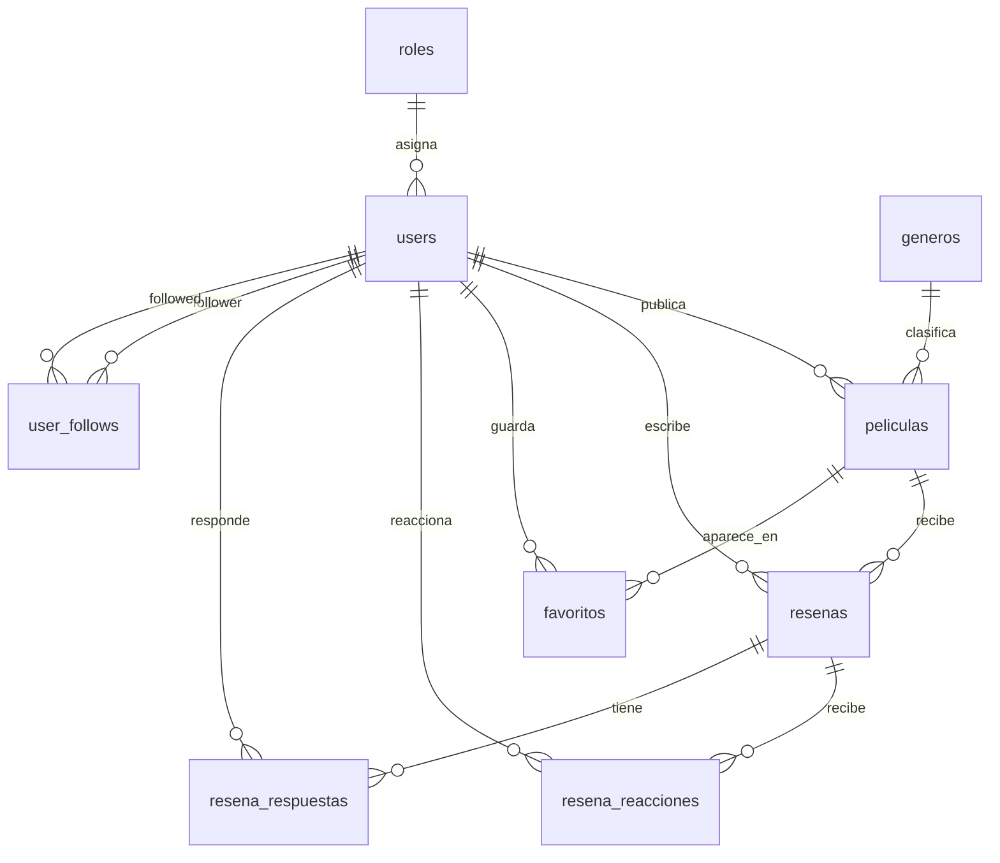
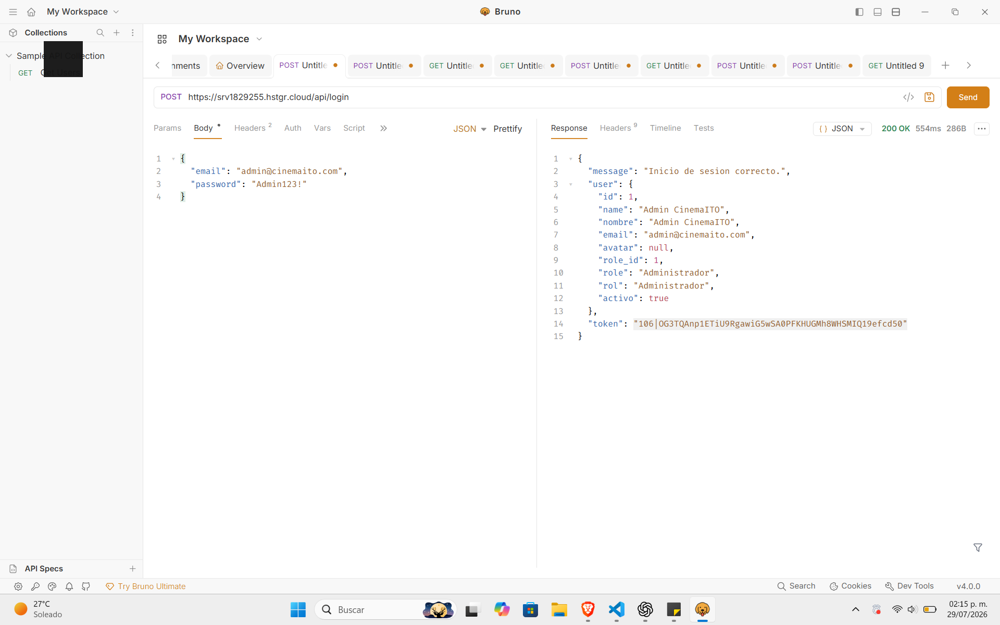
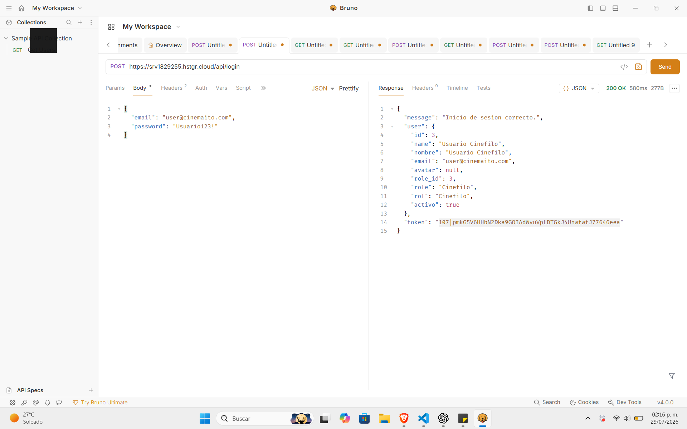
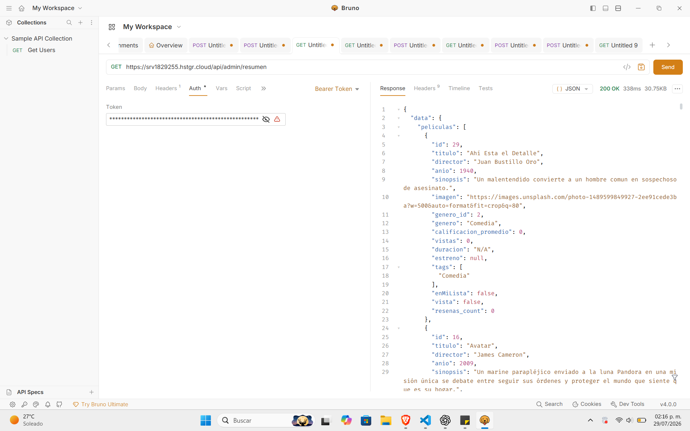
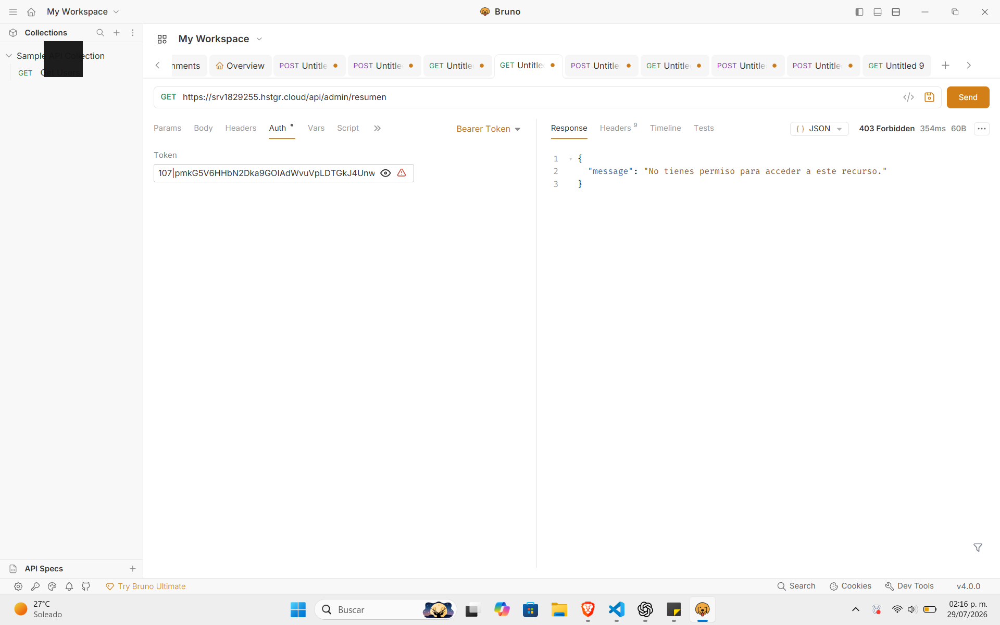
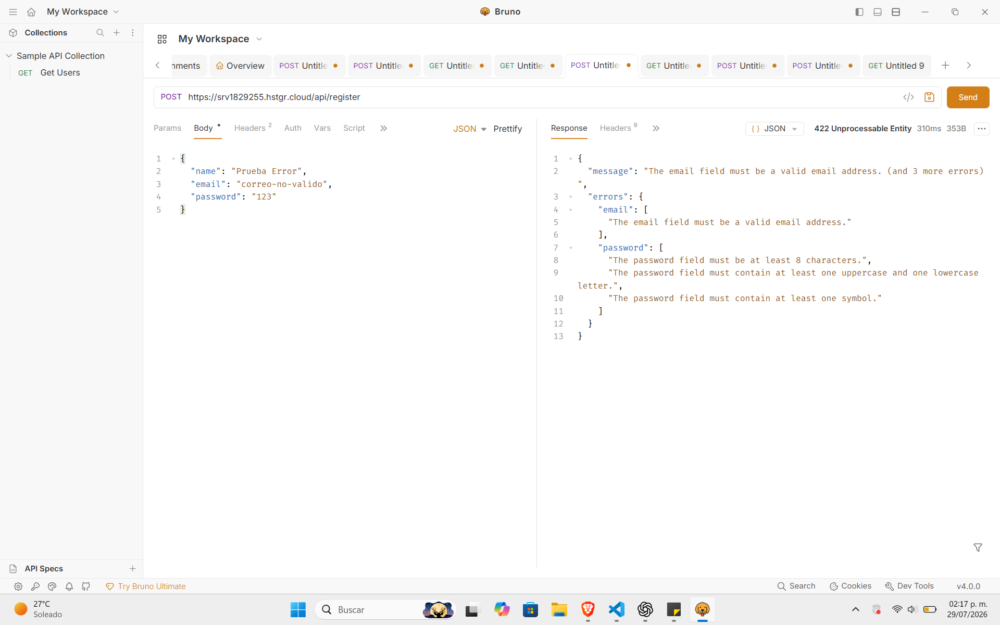
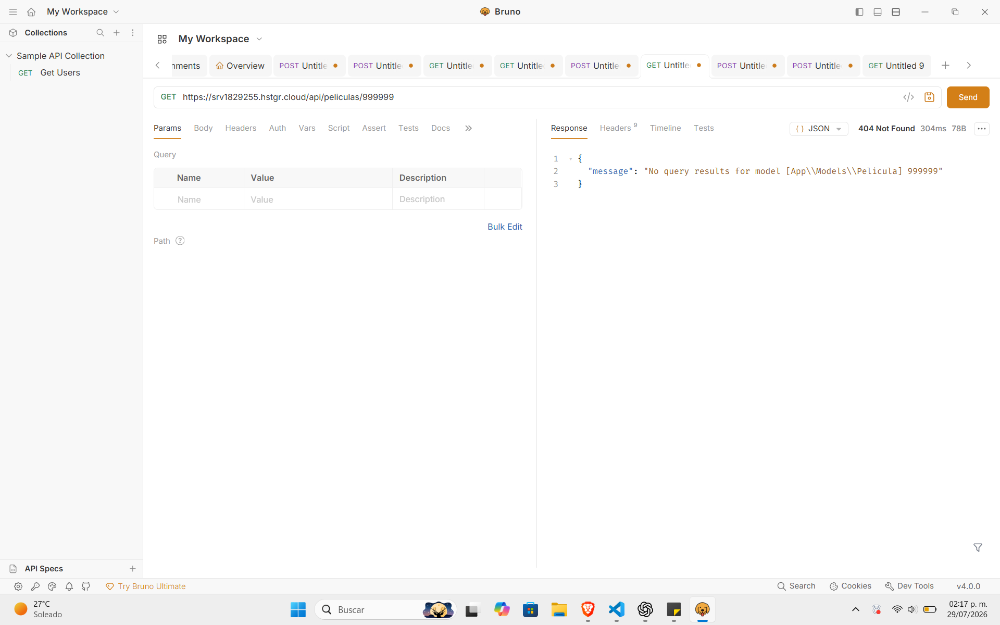
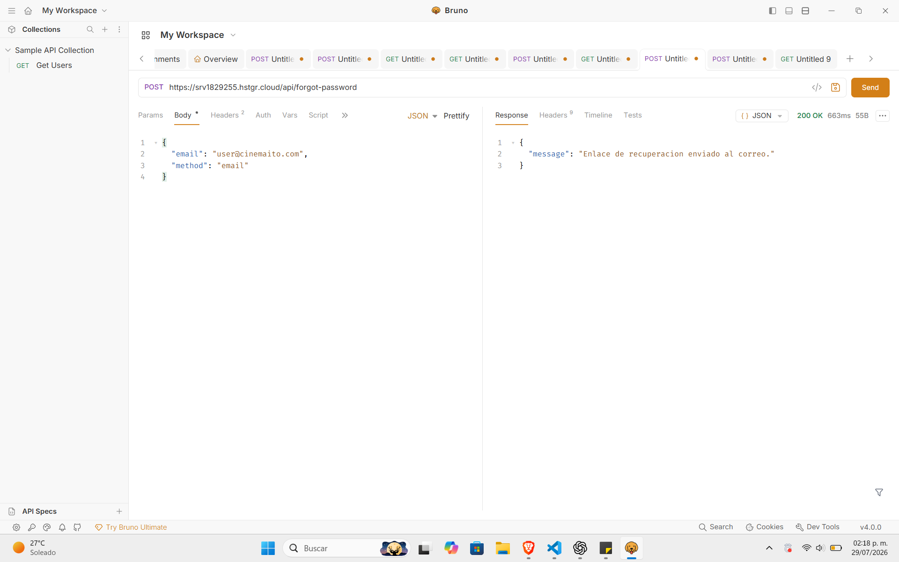
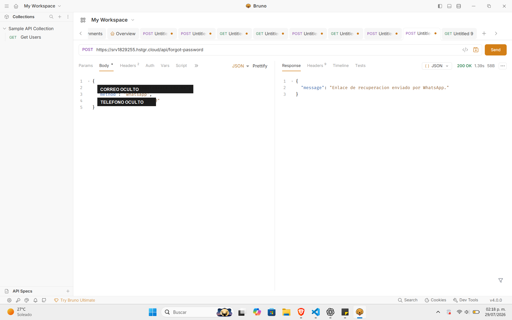

# Cinema ITO

Aplicacion web full stack para descubrir, guardar, comentar y calificar peliculas, con enfoque en cine mexicano y comunidad universitaria del ITO.

> Estado actual: Laravel + React + MySQL, API REST, autenticacion con Sanctum, roles, rutas protegidas, Form Requests, API Resources, panel de Administrador, panel de Moderador, perfiles publicos, seguidores, notificaciones, recuperacion de contrasena, login con Google, coleccion Bruno y despliegue en VPS con HTTPS.

## Integrantes

- Valencia Borja Omar Rutilio
- Angel Gabriel Antonio Mendez

## Enlaces

| Recurso | URL |
| --- | --- |
| Proyecto en produccion | https://srv1829255.hstgr.cloud |
| API base | https://srv1829255.hstgr.cloud/api |
| Repositorio | https://github.com/ProyectoFinalPrograweb/ProyectoFinal |
| GitHub Project | https://github.com/orgs/ProyectoFinalPrograweb/projects/1/views/1 |

## Descripcion

Cinema ITO centraliza recomendaciones, resenas y calificaciones de peliculas en una plataforma colaborativa. Los usuarios pueden crear una cuenta, iniciar sesion, guardar peliculas, marcar peliculas vistas o por ver, escribir resenas con estrellas, responder a otros usuarios, dar like o dislike a resenas y seguir perfiles.

El sistema tambien incluye administracion por roles para que el evaluador pueda verificar control de acceso, CRUDs y restricciones desde el frontend y desde la API.

## Problematica

Las recomendaciones de peliculas suelen perderse en conversaciones, redes sociales o listas personales. Cinema ITO resuelve esto ofreciendo un espacio organizado donde se pueden consultar peliculas, guardar favoritas, registrar opiniones y generar un ranking basado en calificaciones reales de usuarios.

## Tecnologias

| Capa | Tecnologia |
| --- | --- |
| Frontend | React, Vite, React Router, CSS por pagina/componente |
| Backend | Laravel 12, PHP 8.2+, Laravel Sanctum, Socialite |
| Base de datos | MySQL |
| API testing | Bruno |
| Servidor | VPS Linux, HTTPS |
| Servicios externos | Google OAuth, correo SMTP, GREEN-API para WhatsApp |

## Funcionalidades principales

- Registro e inicio de sesion con correo y contrasena.
- Inicio de sesion con Google.
- Notificacion por correo al crear cuenta manualmente o con Google.
- Recuperacion de contrasena por correo.
- Recuperacion de contrasena por WhatsApp mediante GREEN-API.
- Validacion de contrasena segura en frontend y backend.
- Autenticacion protegida con Laravel Sanctum.
- Tres roles: Administrador, Moderador y Cinefilo.
- Middleware por rol en Laravel.
- Rutas protegidas por rol en React.
- Catalogo de peliculas con busqueda, filtros y ordenamiento.
- Importacion/consulta de peliculas desde API externa.
- Lista personal con filtros: todas, vistas y por ver.
- Resenas con calificacion por estrellas.
- Like/dislike en resenas.
- Respuestas a resenas.
- Perfiles publicos de usuarios.
- Seguidores y seguidos.
- Notificaciones navegables.
- Foto de perfil.
- Ranking de mejores peliculas basado en calificaciones de usuarios.
- Panel de Administrador.
- Panel de Moderador.
- Coleccion Bruno para demostrar endpoints.

## Roles y permisos

| Rol | Permisos principales |
| --- | --- |
| Administrador | Acceso total, gestion de peliculas, generos, usuarios, roles y resenas. Puede eliminar usuarios y administrar todo el contenido. |
| Moderador | Revision de contenido. Puede acceder al panel de moderacion y eliminar resenas inapropiadas. |
| Cinefilo | Usuario estandar. Puede guardar peliculas, marcar vistas/por ver, escribir resenas, reaccionar, responder, seguir usuarios y editar su perfil. |

## Credenciales de prueba

Estas cuentas se cargan con los seeders y sirven para evaluacion.

| Rol | Correo | Contrasena |
| --- | --- | --- |
| Administrador | admin@cinemaito.com | Admin123! |
| Moderador | mod@cinemaito.com | Moderador123! |
| Cinefilo | user@cinemaito.com | Usuario123! |
| Evaluador/Admin | developer@cinemaito.com | Developer123! |

## Reglas de seguridad de contrasena

La contrasena debe cumplir:

- Minimo 8 caracteres.
- Al menos una mayuscula.
- Al menos un numero.
- Al menos un caracter especial.

Se valida en:

- Frontend, debajo del input de contrasena.
- Backend, usando Form Requests de Laravel.

## Modulos y tablas principales

### users

Guarda usuarios, correo, contrasena cifrada, avatar y rol.

Relaciones:

- Pertenece a un rol.
- Tiene muchas resenas.
- Tiene muchas peliculas favoritas.
- Puede seguir a otros usuarios.
- Puede recibir notificaciones.

### roles

Define permisos principales del sistema.

Roles actuales:

- Administrador
- Moderador
- Cinefilo

### peliculas

Guarda informacion del catalogo.

Campos principales:

- titulo
- director
- anio
- sinopsis
- imagen
- genero_id
- usuario_id

### generos

Clasifica peliculas por categoria.

### resenas

Guarda comentario y calificacion de un usuario sobre una pelicula.

La calificacion se usa para calcular el ranking.

### favoritos

Relaciona usuarios con peliculas guardadas. Incluye estado para saber si la pelicula esta vista o por ver.

### resena_reacciones

Guarda like o dislike de usuarios sobre resenas.

### resena_respuestas

Guarda respuestas de usuarios a resenas.

### user_follows

Guarda relacion de seguidores y seguidos entre usuarios.

### notifications

Guarda notificaciones de:

- Nuevo seguidor.
- Like en resena.
- Respuesta a resena.

## Relaciones principales



## Ranking de mejores peliculas

El inicio incluye una seccion llamada "Ranking de mejores peliculas".

El ranking se calcula con datos reales de las resenas:

- Laravel obtiene el promedio con `withAvg('resenas as calificacion_promedio', 'calificacion')`.
- Laravel cuenta las resenas con `withCount('resenas')`.
- React muestra solo peliculas con al menos una resena.
- El orden principal es por promedio de calificacion.
- Si hay empate, se ordena por cantidad de resenas.

Esto permite explicar a la profesora que el ranking no esta escrito manualmente, sino que depende de las estrellas que dejan los usuarios.

## Instalacion local

### Requisitos

- PHP 8.2 o superior.
- Composer.
- Node.js y npm.
- MySQL.
- WAMP, XAMPP o MySQL local.

### Base de datos local

Crear la base de datos:

```sql
CREATE DATABASE cine_ito CHARACTER SET utf8mb4 COLLATE utf8mb4_unicode_ci;
```

Configurar `backend/.env`:

```env
APP_NAME="Cinema ITO"
APP_ENV=local
APP_DEBUG=true
APP_URL=http://127.0.0.1:8000
FRONTEND_URL=http://127.0.0.1:5173

DB_CONNECTION=mysql
DB_HOST=127.0.0.1
DB_PORT=3306
DB_DATABASE=cine_ito
DB_USERNAME=root
DB_PASSWORD=
```

### Backend local

```bash
cd backend
composer install
copy .env.example .env
php artisan key:generate
php artisan migrate:fresh --seed
php artisan serve
```

Si Composer no esta en PATH pero existe `composer.phar`:

```bash
php composer.phar install
```

Backend local:

```text
http://127.0.0.1:8000
```

API local:

```text
http://127.0.0.1:8000/api
```

### Frontend local

```bash
cd frontend
npm.cmd install
npm.cmd run dev
```

Frontend local:

```text
http://127.0.0.1:5173
```

## Variables de entorno importantes

No subir secretos reales al repositorio. Deben ir en `backend/.env`.

### Google OAuth

```env
GOOGLE_CLIENT_ID=
GOOGLE_CLIENT_SECRET=
GOOGLE_REDIRECT_URI=https://srv1829255.hstgr.cloud/api/auth/google/callback
```

Callback que debe registrarse en Google Cloud:

```text
https://srv1829255.hstgr.cloud/api/auth/google/callback
```

### Facebook OAuth

El boton de Facebook fue retirado de la interfaz porque no se completo la configuracion. El backend conserva soporte para Socialite si se decide activarlo despues.

```env
FACEBOOK_CLIENT_ID=
FACEBOOK_CLIENT_SECRET=
FACEBOOK_REDIRECT_URI=https://srv1829255.hstgr.cloud/api/auth/facebook/callback
```

### Correo

```env
MAIL_MAILER=smtp
MAIL_HOST=
MAIL_PORT=
MAIL_USERNAME=
MAIL_PASSWORD=
MAIL_ENCRYPTION=
MAIL_FROM_ADDRESS=
MAIL_FROM_NAME="Cinema ITO"
```

Se usa para:

- Notificacion de cuenta creada.
- Recuperacion de contrasena por correo.

### WhatsApp con GREEN-API

```env
GREEN_API_ID_INSTANCE=
GREEN_API_TOKEN_INSTANCE=
```

Se usa para enviar el enlace de recuperacion de contrasena por WhatsApp.

## Endpoints principales

URL base produccion:

```text
https://srv1829255.hstgr.cloud/api
```

URL base local:

```text
http://127.0.0.1:8000/api
```

### Autenticacion

| Metodo | Endpoint | Descripcion |
| --- | --- | --- |
| POST | `/register` | Crear cuenta |
| POST | `/login` | Iniciar sesion |
| POST | `/logout` | Cerrar sesion |
| GET | `/me` | Obtener usuario autenticado |
| PUT | `/profile` | Actualizar nombre, correo o avatar |
| PUT | `/profile/password` | Cambiar contrasena |
| GET | `/auth/google/redirect` | Redireccionar a Google |
| GET | `/auth/google/callback` | Callback de Google |
| POST | `/forgot-password` | Solicitar recuperacion por correo o WhatsApp |
| POST | `/reset-password` | Restablecer contrasena |

### Catalogo

| Metodo | Endpoint | Descripcion |
| --- | --- | --- |
| GET | `/generos` | Listar generos |
| GET | `/peliculas` | Listar peliculas con filtros |
| GET | `/peliculas/{id}` | Detalle de pelicula |
| GET | `/peliculas-api/buscar?query=roma` | Buscar en API externa |
| GET | `/peliculas-api/detalle/{id}` | Detalle desde API externa |

Parametros utiles de `/peliculas`:

```text
search=roma
genero_id=1
orden=calificacion|vistas|recientes
page=1
per_page=12
```

### Funciones de usuario autenticado

Requieren token Bearer de Sanctum.

| Metodo | Endpoint | Descripcion |
| --- | --- | --- |
| GET | `/favoritos` | Ver mi lista |
| POST | `/peliculas/{id}/favorito` | Agregar/quitar de mi lista |
| PUT | `/peliculas/{id}/vista` | Marcar vista o por ver |
| POST | `/peliculas/{id}/resenas` | Crear o actualizar resena |
| POST | `/resenas/{id}/reaccion` | Like/dislike en resena |
| POST | `/resenas/{id}/respuestas` | Responder resena |
| POST | `/usuarios/{id}/seguir` | Seguir/dejar de seguir usuario |
| GET | `/notifications` | Listar notificaciones |
| POST | `/notifications/{id}/read` | Marcar notificacion como leida |
| POST | `/notifications/read-all` | Marcar todas como leidas |
| POST | `/peliculas/importar-favorito` | Importar pelicula externa y guardarla |

### Perfiles publicos

| Metodo | Endpoint | Descripcion |
| --- | --- | --- |
| GET | `/usuarios/{id}` | Perfil publico |
| GET | `/usuarios/{id}/seguidores` | Lista de seguidores |
| GET | `/usuarios/{id}/seguidos` | Lista de usuarios seguidos |

### Administrador

Requiere rol `Administrador`.

| Metodo | Endpoint | Descripcion |
| --- | --- | --- |
| GET | `/admin/resumen` | Datos para panel admin |
| POST | `/admin/peliculas` | Crear pelicula |
| PUT | `/admin/peliculas/{id}` | Editar pelicula |
| DELETE | `/admin/peliculas/{id}` | Eliminar pelicula |
| POST | `/admin/generos` | Crear genero |
| PUT | `/admin/generos/{id}` | Editar genero |
| DELETE | `/admin/generos/{id}` | Eliminar genero |
| DELETE | `/admin/resenas/{id}` | Eliminar resena |
| PUT | `/admin/users/{id}/role` | Cambiar rol de usuario |
| DELETE | `/admin/users/{id}` | Eliminar usuario |
| POST | `/admin/peliculas/sincronizar-posters` | Sincronizar posters desde API externa |

### Moderador

Requiere rol `Administrador` o `Moderador`.

| Metodo | Endpoint | Descripcion |
| --- | --- | --- |
| GET | `/moderador/resumen` | Datos para panel moderador |
| DELETE | `/moderador/resenas/{id}` | Eliminar resena inapropiada |

## Ejemplos para Bruno

La coleccion esta en:

```text
bruno/
```

### Login

```http
POST {{base_url}}/login
Content-Type: application/json

{
  "email": "admin@cinemaito.com",
  "password": "Admin123!"
}
```

Guardar el token recibido y usarlo como:

```text
Authorization: Bearer {{token}}
```

### Crear resena

```http
POST {{base_url}}/peliculas/1/resenas
Authorization: Bearer {{token}}
Content-Type: application/json

{
  "calificacion": 9,
  "comentario": "Excelente pelicula mexicana, muy recomendable."
}
```

### Reaccionar a resena

```http
POST {{base_url}}/resenas/1/reaccion
Authorization: Bearer {{token}}
Content-Type: application/json

{
  "tipo": "like"
}
```

### Responder resena

```http
POST {{base_url}}/resenas/1/respuestas
Authorization: Bearer {{token}}
Content-Type: application/json

{
  "comentario": "Estoy de acuerdo, la actuacion es muy buena."
}
```

### Cambiar rol

```http
PUT {{base_url}}/admin/users/3/role
Authorization: Bearer {{token}}
Content-Type: application/json

{
  "role_id": 2
}
```

## Evidencias Bruno

Las siguientes capturas muestran pruebas ejecutadas contra la API desplegada en el VPS.

> Nota: los tokens y datos sensibles fueron ocultados en las imagenes antes de documentarlas.

### 1. Login de Administrador

Endpoint probado:

```http
POST https://srv1829255.hstgr.cloud/api/login
```

Body utilizado:

```json
{
  "email": "admin@cinemaito.com",
  "password": "Admin123!"
}
```

Resultado: `200 OK`. La API autentica al administrador, devuelve los datos del usuario con rol `Administrador` y genera un token de acceso para rutas protegidas.



### 2. Login de Cinefilo

Endpoint probado:

```http
POST https://srv1829255.hstgr.cloud/api/login
```

Body utilizado:

```json
{
  "email": "user@cinemaito.com",
  "password": "Usuario123!"
}
```

Resultado: `200 OK`. La API autentica al usuario estandar con rol `Cinefilo` y genera un token propio para probar permisos limitados.



### 3. Ruta protegida de Administrador

Endpoint probado:

```http
GET https://srv1829255.hstgr.cloud/api/admin/resumen
Authorization: Bearer TOKEN_ADMIN
```

Resultado: `200 OK`. El token de administrador permite consultar el resumen del panel administrativo, incluyendo peliculas, usuarios, resenas, generos y roles.



### 4. Error 403 por rol incorrecto

Endpoint probado:

```http
GET https://srv1829255.hstgr.cloud/api/admin/resumen
Authorization: Bearer TOKEN_CINEFILO
```

Resultado: `403 Forbidden`. El usuario `Cinefilo` no tiene permiso para acceder al panel administrativo. Esta prueba demuestra que el middleware por rol funciona en el backend.



### 5. Error 422 por registro invalido

Endpoint probado:

```http
POST https://srv1829255.hstgr.cloud/api/register
```

Body utilizado:

```json
{
  "name": "Prueba Error",
  "email": "correo-no-valido",
  "password": "123"
}
```

Resultado: `422 Unprocessable Entity`. Laravel rechaza el correo invalido y la contrasena insegura. Esto demuestra validaciones de Form Request en el backend.



### 6. Error 404 por pelicula inexistente

Endpoint probado:

```http
GET https://srv1829255.hstgr.cloud/api/peliculas/999999
```

Resultado: `404 Not Found`. La API responde correctamente cuando se solicita una pelicula que no existe.



### 7. Recuperacion por correo

Endpoint probado:

```http
POST https://srv1829255.hstgr.cloud/api/forgot-password
```

Body utilizado:

```json
{
  "email": "user@cinemaito.com",
  "method": "email"
}
```

Resultado: `200 OK`. El sistema genera el enlace de recuperacion y lo envia por correo.



### 8. Recuperacion por WhatsApp

Endpoint probado:

```http
POST https://srv1829255.hstgr.cloud/api/forgot-password
```

Body utilizado:

```json
{
  "email": "correo@ejemplo.com",
  "method": "whatsapp",
  "telefono": "9510000000"
}
```

Resultado: `200 OK`. El sistema genera el enlace de recuperacion y lo envia por WhatsApp mediante GREEN-API.



## Despliegue en VPS

Ruta del proyecto en el servidor:

```text
/var/www/html/cinema-ito
```

Ruta publica usada por el servidor:

```text
/var/www/html/cinema-ito/backend/public
```

### Publicar cambios de frontend

En Windows local:

```powershell
cd C:\wamp64\www\repaso-php\ProyectoFinal\frontend
npm.cmd run build
pscp -hostkey "SHA256:EKNiqRpDEgnc6jDk2i0UHOJcTwuy8UfB1uDLHSCbflQ" -r "C:\wamp64\www\repaso-php\ProyectoFinal\frontend\dist\*" omar@168.231.75.27:/tmp/cinema-ito-dist/
```

En el VPS:

```bash
cd /var/www/html/cinema-ito/backend/public
mkdir -p assets
find assets -maxdepth 1 -type f -delete
cp -a /tmp/cinema-ito-dist/assets/. assets/
cp /tmp/cinema-ito-dist/index.html .
cp /tmp/cinema-ito-dist/*.png . 2>/dev/null || true
cp /tmp/cinema-ito-dist/*.svg . 2>/dev/null || true
```

### Publicar cambios de backend

En el VPS:

```bash
cd /var/www/html/cinema-ito
git pull
cd backend
composer install --no-dev --optimize-autoloader
php artisan migrate --force
php artisan optimize:clear
php artisan config:cache
php artisan route:cache
php artisan view:cache
```

## Comandos utiles en VPS

Entrar al proyecto:

```bash
cd /var/www/html/cinema-ito/backend
```

Ver variables configuradas:

```bash
cat .env
```

Probar estado de Laravel:

```bash
php artisan about
```

Limpiar cache:

```bash
php artisan optimize:clear
```

Entrar a MySQL:

```bash
mysql -u cine_ito_user -p cine_ito
```

Comandos SQL utiles:

```sql
SHOW TABLES;
SELECT id, name, email, role_id FROM users;
SELECT id, titulo, anio FROM peliculas LIMIT 10;
SELECT pelicula_id, AVG(calificacion), COUNT(*) FROM resenas GROUP BY pelicula_id;
```

## Estructura del repositorio

```text
ProyectoFinal/
  backend/      Laravel, API, migraciones, seeders y logica del sistema
  frontend/     React, Vite, estilos y vistas
  bruno/        Coleccion de pruebas para API
  README.md     Documentacion del proyecto
```

## Puntos para explicar en exposicion

- El frontend no trabaja solo con datos falsos: consume la API de Laravel.
- Las rutas protegidas usan token de Sanctum.
- El backend restringe permisos con middleware por rol.
- React tambien oculta rutas y componentes segun rol.
- Las contrasenas se cifran con hash.
- El ranking se calcula con promedios reales de resenas.
- Las notificaciones se guardan en base de datos y navegan al recurso relacionado.
- La recuperacion de contrasena puede enviarse por correo o WhatsApp.
- El panel Admin y Moderador prueban control de acceso real.

## Estado final

El proyecto cumple con:

- Full stack funcional.
- Base de datos MySQL.
- API REST documentable con Bruno.
- Login y registro.
- Roles y permisos.
- CRUD administrativo.
- Moderacion.
- Resenas, reacciones y respuestas.
- Perfiles sociales.
- Ranking por calificaciones.
- Despliegue en VPS con HTTPS.

Las credenciales reales de servicios externos no deben guardarse en GitHub.
