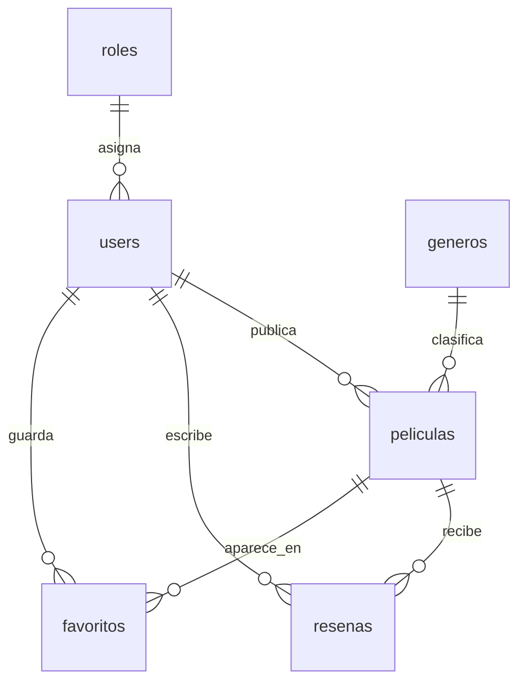

# Cinema ITO

> Estado actual: Laravel + React + MySQL local, con Sanctum, roles, rutas protegidas, Form Requests, API Resources, panel Admin, panel Moderador, Bruno y respaldo SQL.

## Integrantes

- Valencia Borja Omar Rutilio
- Angel Gabriel Antonio Mendez

## Descripcion del proyecto

Cinema ITO sera una plataforma web para registrar, comentar, calificar y recomendar peliculas mexicanas vistas por los usuarios. La idea principal es crear una comunidad donde cada usuario pueda compartir su opinion sobre peliculas mexicanas, descubrir nuevas recomendaciones y guardar las peliculas que le interesan.

## Problematica que resuelve

Actualmente muchas recomendaciones de peliculas mexicanas se pierden en conversaciones, redes sociales o listas personales. No siempre existe un espacio organizado donde los usuarios puedan registrar que peliculas mexicanas han visto, calificarlas, escribir una opinion y consultar comentarios de otras personas.

Cinema ITO resuelve esta problematica centralizando la informacion en una plataforma colaborativa. El sistema permitira consultar peliculas mexicanas, publicar resenas, asignar calificaciones, guardar favoritas y facilitar la interaccion entre usuarios interesados en el cine mexicano.

## Modulos principales del sistema

El sistema tendra al menos las siguientes entidades o tablas relacionadas:

### 1. Usuarios

Almacena la informacion de las personas que usaran la plataforma.

Campos principales:

- `id`
- `nombre`
- `email`
- `password`
- `rol_id`
- `created_at`
- `updated_at`

Relacion:

- Un usuario pertenece a un rol.
- Un usuario puede publicar muchas peliculas.
- Un usuario puede escribir muchas resenas.
- Un usuario puede guardar muchas peliculas favoritas.

### 2. Roles

Define los permisos o tipos de usuario dentro del sistema.

Campos principales:

- `id`
- `nombre`
- `descripcion`

Relacion:

- Un rol puede estar asignado a muchos usuarios.

### 3. Peliculas

Registra las peliculas mexicanas publicadas en la plataforma.

Campos principales:

- `id`
- `titulo`
- `director`
- `anio`
- `sinopsis`
- `imagen`
- `genero_id`
- `usuario_id`
- `created_at`
- `updated_at`

Relacion:

- Una pelicula pertenece a un genero.
- Una pelicula fue publicada por un usuario.
- Una pelicula puede tener muchas resenas.
- Una pelicula puede estar en favoritos de muchos usuarios.

### 4. Generos

Clasifica las peliculas por categoria.

Campos principales:

- `id`
- `nombre`
- `descripcion`

Relacion:

- Un genero puede tener muchas peliculas.

### 5. Reseñas

Guarda los comentarios y calificaciones que los usuarios hacen sobre las peliculas.

Campos principales:

- `id`
- `usuario_id`
- `pelicula_id`
- `comentario`
- `calificacion`
- `created_at`
- `updated_at`

Relacion:

- Una resena pertenece a un usuario.
- Una resena pertenece a una pelicula.

### 6. Favoritos

Permite que los usuarios guarden peliculas que les gustaron o quieren ver despues.

Campos principales:

- `id`
- `usuario_id`
- `pelicula_id`
- `created_at`

Relacion:

- Un usuario puede tener muchas peliculas favoritas.
- Una pelicula puede ser marcada como favorita por muchos usuarios.

## Roles de usuario

### Administrador

Puede gestionar todo el sistema:

- Administrar usuarios.
- Administrar roles.
- Crear, editar y eliminar peliculas.
- Administrar generos.
- Revisar o eliminar resenas inapropiadas.

### Moderador

Puede apoyar en el control del contenido:

- Revisar peliculas publicadas.
- Revisar comentarios o resenas.
- Ocultar o eliminar contenido inapropiado.

### Usuario registrado

Puede usar las funciones principales de la plataforma:

- Registrarse e iniciar sesion.
- Publicar peliculas mexicanas vistas.
- Comentar peliculas.
- Calificar peliculas.
- Guardar peliculas favoritas.
- Consultar recomendaciones y resenas de otros usuarios.

## Relaciones principales

```text
roles 1 --- N usuarios
usuarios 1 --- N peliculas
generos 1 --- N peliculas
usuarios 1 --- N resenas
peliculas 1 --- N resenas
usuarios N --- N peliculas mediante favoritos
```

## Base de datos local

Motor requerido: MySQL.

Nombre de la base de datos:

```text
cine_ito
```

Primero crear la base `cine_ito` en phpMyAdmin o importar directamente `backend/database/cine_ito_backup.sql`.

Configuracion sugerida en `backend/.env`:

```env
DB_CONNECTION=mysql
DB_HOST=127.0.0.1
DB_PORT=3306
DB_DATABASE=cine_ito
DB_USERNAME=root
DB_PASSWORD=
```

Para crear las tablas y cargar datos de prueba desde Laravel:

```bash
cd backend
php artisan migrate --seed
```

Tambien se incluye el respaldo SQL en:

```text
backend/database/cine_ito_backup.sql
```

Credenciales de prueba:

| Rol | Correo | Contrasena |
| --- | --- | --- |
| Administrador | admin@cinemaito.com | Admin123! |
| Moderador | mod@cinemaito.com | Moderador123! |
| Cinefilo | user@cinemaito.com | Usuario123! |
| Developer/Evaluador | developer@cinemaito.com | Developer123! |

## Repositorio

Repositorio de GitHub:

```text
https://github.com/ProyectoFinalPrograweb/ProyectoFinal
```

## GitHub Projects

Tablero de GitHub Projects:

https://github.com/orgs/ProyectoFinalPrograweb/projects/1/views/1

El tablero debera configurarse con las siguientes columnas:

- Backlog
- To Do
- In Progress
- In Review
- Done

## Tareas iniciales para GitHub Projects

### Tareas sugeridas para Omar

1. Crear estructura inicial del proyecto.
2. Configurar repositorio y README.
3. Definir migracion de usuarios.
4. Definir migracion de roles.
5. Implementar autenticacion de usuarios.
6. Crear modelo y migracion de peliculas.
7. Implementar listado de peliculas.
8. Implementar registro de peliculas.
9. Implementar edicion de peliculas.
10. Implementar eliminacion de peliculas.

### Tareas sugeridas para Angel Gabriel Antonio Mendez

1. Crear modelo y migracion de generos.
2. Implementar CRUD de generos.
3. Crear modelo y migracion de resenas.
4. Implementar comentarios por pelicula.
5. Implementar calificacion de peliculas.
6. Crear modelo y migracion de favoritos.
7. Implementar agregar pelicula a favoritos.
8. Implementar listado de favoritos por usuario.
9. Implementar busqueda de peliculas.
10. Probar funcionalidades principales del sistema.

## Tecnologias utilizadas

- Backend: Laravel 12, Laravel Sanctum, PHP 8.2+
- Frontend: React, Vite, React Router
- Base de datos: MySQL
- Pruebas de API: Bruno
- Estilos: CSS modular por pagina/componente

## Instalacion y ejecucion local

Backend:

```bash
cd backend
php composer.phar install
copy .env.example .env
php artisan key:generate
php artisan migrate:fresh --seed
php artisan serve
```

Frontend:

```bash
cd frontend
npm.cmd install
npm.cmd run dev
```

URLs locales:

```text
Frontend: http://127.0.0.1:5173
API: http://127.0.0.1:8000/api
```

## API documentada

Publicas:

```text
POST /api/register
POST /api/login
POST /api/forgot-password
POST /api/reset-password
GET  /api/generos
GET  /api/peliculas
GET  /api/peliculas/{id}
```

Protegidas con Sanctum:

```text
GET    /api/me
POST   /api/logout
GET    /api/favoritos
POST   /api/peliculas/{id}/favorito
POST   /api/peliculas/{id}/resenas
```

Administrador:

```text
GET    /api/admin/resumen
POST   /api/admin/peliculas
PUT    /api/admin/peliculas/{id}
DELETE /api/admin/peliculas/{id}
POST   /api/admin/generos
PUT    /api/admin/generos/{id}
DELETE /api/admin/generos/{id}
DELETE /api/admin/resenas/{id}
PUT    /api/admin/users/{id}/role
```

Moderador:

```text
GET    /api/moderador/resumen
DELETE /api/moderador/resenas/{id}
```

## Bruno

La coleccion de Bruno esta versionada en:

```text
bruno/
```

Incluye pruebas de:

- Login y obtencion del token.
- Uso del token en endpoint protegido.
- Error 403 por rol incorrecto.
- Error 422 por datos invalidos.
- Error 404 por recurso inexistente.
- Recuperacion de contrasena.

## Diagrama ER



## Figma

Pendiente pegar el link real del prototipo navegable:

```text
URL FIGMA: PENDIENTE
```

Debe incluir pantallas por rol, paleta justificada y logo original.

## VPS

Pendiente para entrega final:

```text
URL PROYECTO HTTPS: PENDIENTE
URL BASE API HTTPS: PENDIENTE
```

Checklist VPS:

- Clonar repositorio.
- Configurar `.env` real.
- Instalar dependencias de Laravel.
- Instalar y compilar frontend.
- Ejecutar migraciones y seeders.
- Configurar Nginx como proxy reverso.
- Configurar HTTPS con Certbot.
- Configurar correo real con Postfix, SPF y DKIM.
- Configurar SMS y WhatsApp con variables reales.

## Comunicacion real pendiente

- Correo real desde VPS con Postfix.
- SMS desde una API como Twilio.
- WhatsApp desde Twilio o WhatsApp Cloud API.

Las variables sensibles deben ir en `.env` y nunca subirse al repositorio.
